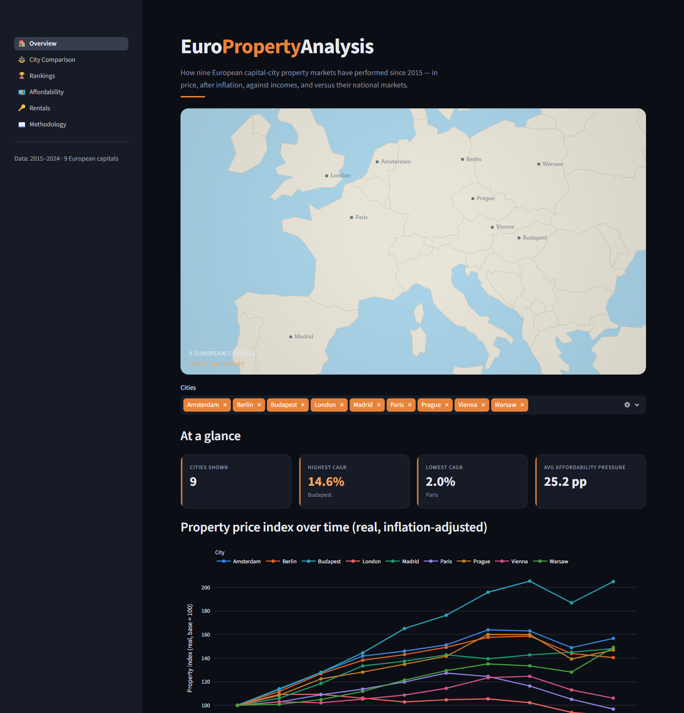
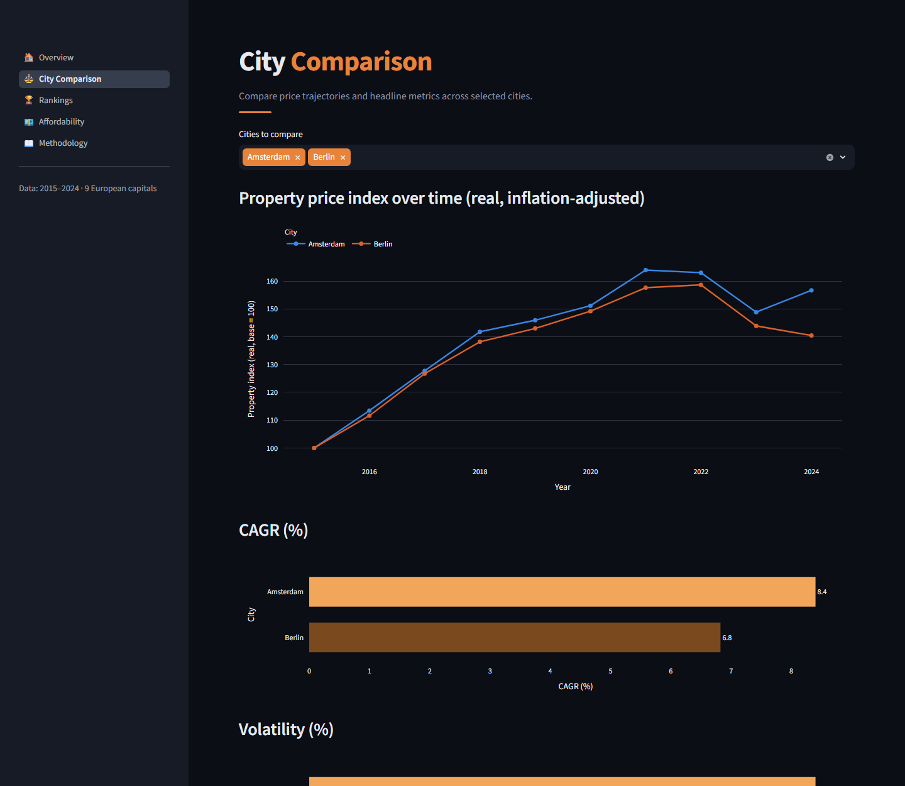
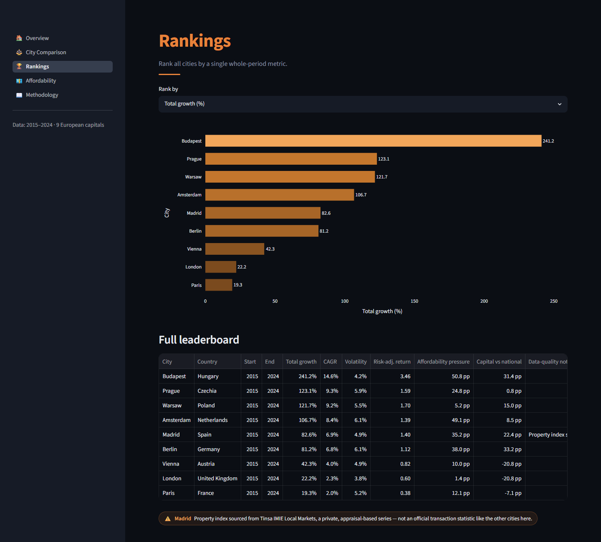
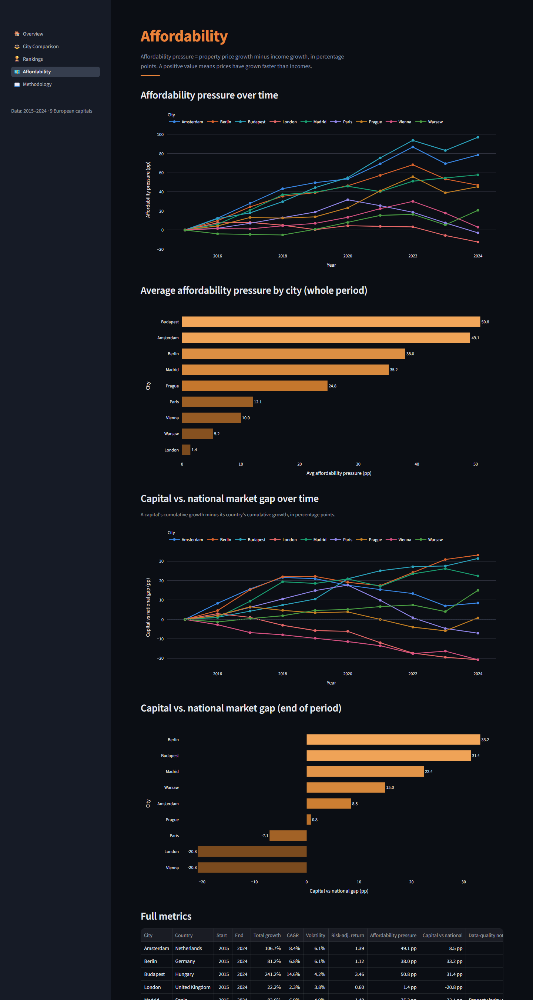

# EuroPropertyAnalysis

A Python analytics project comparing residential property market performance across nine European
capital cities from **2015 to 2024**, benchmarked against each country's wider national housing
market — built end to end from raw statistical-office data to a live dashboard.

## The question it answers

How have European capital-city property markets performed since 2015, and how do they compare
with their wider national housing markets — in nominal terms, after inflation, and on a
risk-adjusted basis?

## Live dashboard

_Not yet deployed — runs locally, see "How to run locally" below. Live link coming soon
(Streamlit Community Cloud)._

## Dashboard preview

| Overview | City Comparison |
|---|---|
|  |  |

| Rankings | Affordability |
|---|---|
|  |  |

## Key results (2015–2024)

- **Strongest growth:** Budapest, +241% nominal (14.6% CAGR) — the standout across the whole set.
- **Weakest growth:** Paris, +19% nominal (2.0% CAGR), just behind London at +22% (2.3% CAGR).
- **Biggest capital-vs-national outperformance:** Berlin, +33pp ahead of the German national
  market over the period; Budapest close behind at +31pp ahead of Hungary.
- **Biggest capital-vs-national underperformance:** Vienna and London, both roughly -21pp behind
  their own national markets — in both cities the capital rose *more slowly* than the country as
  a whole.
- **Sharpest affordability pressure:** Budapest, where cumulative property price growth outpaced
  income growth by 51pp on average across the period — the largest gap of any city studied.

Full per-city figures: run the dashboard's Rankings and Affordability pages, or query
`summary_metrics` directly.

## Key questions

- Which European capitals had the strongest property price growth?
- Which cities performed best **after inflation**?
- Which cities had the best **risk-adjusted** returns?
- Which capitals **outperformed** their national housing markets?
- Where is **affordability pressure** (prices vs incomes) strongest?

## Cities analysed

London, Paris, Berlin, Madrid, Amsterdam, Vienna, Warsaw, Prague, Budapest (9 capitals — Lisbon
was evaluated but excluded; see `docs/data_sources.md` for the full data-discovery writeup).
Madrid's property index is a private, appraisal-based series (Tinsa) rather than an official
transaction statistic like every other city here — flagged directly in the dashboard.

## Methodology (summary)

Property price indices are rebased to 100 at the start year. From these we compute total growth,
CAGR, year-on-year growth, volatility (variability of annual growth), and a risk-adjusted return
(CAGR ÷ volatility). Real (inflation-adjusted) figures deflate the nominal index by CPI.
Affordability pressure is **property-price growth minus income growth (percentage points)**.
Capital-vs-national compares each city index against its national house price index.
Full details: [`docs/methodology.md`](docs/methodology.md).

## Tech stack

Python · pandas · numpy · SQLite · SQLAlchemy · Plotly · Streamlit · pytest

## How to run locally (Windows)

```bat
python -m venv .venv
.venv\Scripts\activate
pip install -r requirements.txt -r requirements-dev.txt
pytest
python -m src.pipeline.real_pipeline
streamlit run dashboard/app.py
```

## Project structure

```
src/
  config/          settings: paths, DB URL, city/country definitions
  metrics/         pure, tested calculations (returns, risk, affordability)
  transformation/  rebasing & inflation adjustment (pure functions)
  database/        SQLAlchemy models, connection, repository
  services/        analytics service layer the dashboard reads from
  pipeline/        CSV loading + end-to-end pipeline runner
  utils/           logging configuration
dashboard/         Streamlit app (read-only)
tests/             pytest unit tests
data/              raw (committed CSVs), processed, database (generated)
docs/              methodology and data-source notes
```

## Limitations

- Historical analysis only — **no forecasting**.
- Capital appreciation only — no rental yield, currency adjustment, taxes, or transaction costs.
- Data availability varies by city; only cities with credible city-level data are included.
- Past performance does not predict future returns. This is **not** investment advice.

## Future extensions

Forecasting · machine learning · rental yield · currency-adjusted returns · mortgage affordability
· PostgreSQL · FastAPI · CI/CD · data-quality dashboards.
