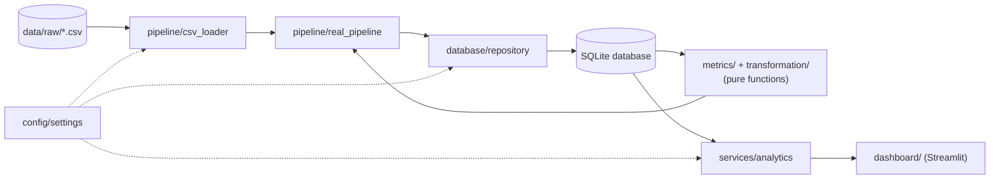

# EuroPropertyAnalysis

[](https://github.com/rocco-griem/EuroPropertyAnalysis/actions/workflows/ci.yml)

A Python analytics project comparing residential property market performance across nine European
capital cities — plus Palma — from **2015 to 2024**, benchmarked against each country's wider
national housing market — built end to end from raw statistical-office data to an interactive dashboard.
A dedicated deep-dive page adds Mallorca (the island) alongside Palma for a closer look.

## The question it answers

How have European capital-city property markets performed since 2015, and how do they compare
with their wider national housing markets — in nominal terms, after inflation, and on a
risk-adjusted basis?

## Running the dashboard

The dashboard runs locally — see "How to run locally" below. It builds its own database
from the committed CSVs on first load, so no setup beyond installing the dependencies.

## Dashboard preview

| Overview | City Comparison |
|---|---|
|  |  |

| Rankings | Affordability |
|---|---|
|  |  |

The Overview page's scroll-driven day→night hero (a flat map and an alternative 3D globe, pick
either) is real NASA satellite photography — Blue Marble by day, VIIRS Black Marble city lights
by night — not illustration. See [`docs/data_sources.md`](docs/data_sources.md#overview-page-hero-imagery).

## Key results (2015–2024)

- **Strongest growth:** Budapest, +241% nominal (14.6% CAGR) — the standout across the whole set.
- **Weakest growth:** Paris, +19% nominal (2.0% CAGR), just behind London at +22% (2.3% CAGR).
- **Biggest capital-vs-national outperformance:** Berlin, +33pp ahead of the German national
  market over the period; Budapest close behind at +31pp ahead of Hungary.
- **Biggest capital-vs-national underperformance:** Vienna and London, both roughly -21pp behind
  their own national markets — in both cities the capital rose *more slowly* than the country as
  a whole.
- **Sharpest affordability pressure:** Budapest, where cumulative property price growth outpaced
  income growth by 51pp on average across the period — the largest gap of any city studied.

Full per-city figures: run the dashboard's Rankings and Affordability pages, or query
`summary_metrics` directly.

## Key questions

- Which European capitals had the strongest property price growth?
- Which cities performed best **after inflation**?
- Which cities had the best **risk-adjusted** returns?
- Which capitals **outperformed** their national housing markets?
- Where is **affordability pressure** (prices vs incomes) strongest?

## Cities analysed

London, Paris, Berlin, Madrid, Amsterdam, Vienna, Warsaw, Prague, Budapest (9 capitals — Lisbon
was evaluated but excluded; see `docs/data_sources.md` for the full data-discovery writeup), plus
**Palma**, added as a place of special interest. Madrid's and Palma's property indices are a
private, appraisal-based series (Tinsa) rather than an official transaction statistic like every
other city here — flagged directly in the dashboard.

A separate **Mallorca Deep Dive** dashboard page adds **Mallorca** (the island, not a city, so
kept out of the main comparison above) alongside Palma, with quarterly price detail back to 2001
— the longest and only sub-annual history in this project so far.

## Methodology (summary)

Property price indices are rebased to 100 at the start year. From these we compute total growth,
CAGR, year-on-year growth, volatility (variability of annual growth), and a risk-adjusted return
(CAGR ÷ volatility). Real (inflation-adjusted) figures deflate the nominal index by CPI.
Affordability pressure is **property-price growth minus income growth (percentage points)**.
Capital-vs-national compares each city index against its national house price index.
Full details: [`docs/methodology.md`](docs/methodology.md).

## Tech stack

Python · pandas · numpy · SQLite · SQLAlchemy · Plotly · Streamlit · pytest

## Architecture

The codebase is layered so each piece is independently testable and the dashboard never touches
data logic directly:

- **`config`** — single source of truth for filesystem paths, the database URL, and the
  city/country definitions every other layer imports.
- **`database`** — SQLAlchemy ORM models (`models.py`), a `repository.py` of query/upsert
  functions that every other layer goes through instead of writing raw SQLAlchemy queries, and
  `connection.py` for engine/session setup.
- **`pipeline`** — loads the committed CSVs (`csv_loader.py`), orchestrates writing raw rows into
  the database via the repository, then drives metric computation (`compute_metrics.py`) end to
  end (`real_pipeline.py`).
- **`metrics` / `transformation`** — pure functions only (no I/O): CAGR, volatility,
  risk-adjusted return, affordability pressure, rebasing, inflation adjustment. Called by
  `pipeline/compute_metrics.py`, unit-tested in isolation.
- **`services`** — `analytics.py`, the only module the dashboard is allowed to query through;
  every function takes a `Session` and returns a `pandas.DataFrame` shaped for one chart or table.
- **`dashboard`** — Streamlit UI. Read-only: it calls `services.analytics`, never SQLAlchemy or
  the database directly.



Data flows one way: raw CSVs are loaded and written to the database through the repository, the
pipeline reads those raw rows back out, runs them through the pure metric/transformation
functions, and writes the computed results to their own tables (`annual_metrics`,
`summary_metrics`) — again through the repository. The dashboard only ever reads the finished
result through `services.analytics`.

## Design decisions

- **Metrics are pure functions.** `src/metrics` and `src/transformation` take plain numbers/dicts
  in and return plain numbers/dicts out — no database, no Streamlit. That makes every formula
  independently unit-testable and reusable outside the dashboard.
- **A repository layer, not raw queries everywhere.** `src/database/repository.py` is the only
  place that writes SQLAlchemy queries; the pipeline and the dashboard's `services` layer both go
  through it. One place to fix a query bug, one place to reason about the schema.
- **SQLite + SQLAlchemy, not a bigger database.** The dataset is small (a handful of European
  cities, 2015–2024) and the app is a single-reader dashboard, so SQLite is enough; SQLAlchemy's
  ORM keeps the schema declarative and the `DATABASE_URL` swappable to Postgres later without
  touching calling code.
- **Data-quality caveats travel with the data, not just the docs.** Where a source is a
  methodological outlier (e.g. Madrid/Palma's private, appraisal-based Tinsa series), that's a
  `City.data_quality_note` column, not only a line in `docs/data_sources.md` — so it surfaces
  directly on the dashboard pages that use it.
- **The database is generated, not committed.** `data/database/*.db` is gitignored; every
  dashboard page calls `ensure_database()` on load, which builds and seeds the database from the
  committed CSVs if it's empty. That's what makes a cold Streamlit Cloud deploy work without a
  manual seeding step.

## Testing

`pytest` covers the pure metric/transformation functions (`test_returns.py`, `test_risk.py`,
`test_affordability.py`, `test_rebasing.py`, `test_inflation_adjustment.py`), the database layer
(`test_database.py`), CSV loading (`test_csv_loader.py`), the end-to-end pipeline
(`test_pipeline.py`, `test_real_pipeline.py`), the dashboard's query layer
(`test_services.py`), and the hero-imagery fetch tooling (`test_hero_imagery.py`) — each against
an in-memory SQLite database, not the real one. Run the full suite with:

```bat
pytest
```

CI (`.github/workflows/ci.yml`) runs `ruff check`, `ruff format --check`, and `pytest` on every
push and pull request to `main`.

## How to run locally (Windows)

```bat
python -m venv .venv
.venv\Scripts\activate
pip install -r requirements.txt -r requirements-dev.txt
pytest
python -m src.pipeline.real_pipeline
streamlit run dashboard/app.py
```

## Project structure

```
src/
  config/          settings: paths, DB URL, city/country definitions
  metrics/         pure, tested calculations (returns, risk, affordability)
  transformation/  rebasing & inflation adjustment (pure functions)
  database/        SQLAlchemy models, connection, repository
  services/        analytics service layer the dashboard reads from
  pipeline/        CSV loading + end-to-end pipeline runner
  utils/           logging configuration
dashboard/         Streamlit app (read-only)
tests/             pytest unit tests
data/              raw (committed CSVs), processed, database (generated)
docs/              methodology and data-source notes
```

## Limitations

- Historical analysis only — **no forecasting**.
- Capital appreciation only — no rental yield, currency adjustment, taxes, or transaction costs.
- Data availability varies by city; only cities with credible city-level data are included.
- Past performance does not predict future returns. This is **not** investment advice.

## Future extensions

Forecasting · machine learning · rental yield · currency-adjusted returns · mortgage affordability
· PostgreSQL · FastAPI · data-quality dashboards.

## How this was built

Developed with [Claude Code](https://claude.com/claude-code) as an AI pair-programmer. I was
responsible for the project scope, data sourcing and evaluation, the methodology, the
architecture decisions, and for reviewing the resulting code.

## License

Code is licensed under the [MIT License](LICENSE). The underlying data remains under each
original source's own terms — see [`docs/data_sources.md`](docs/data_sources.md) for the
per-source breakdown and licensing notes.
